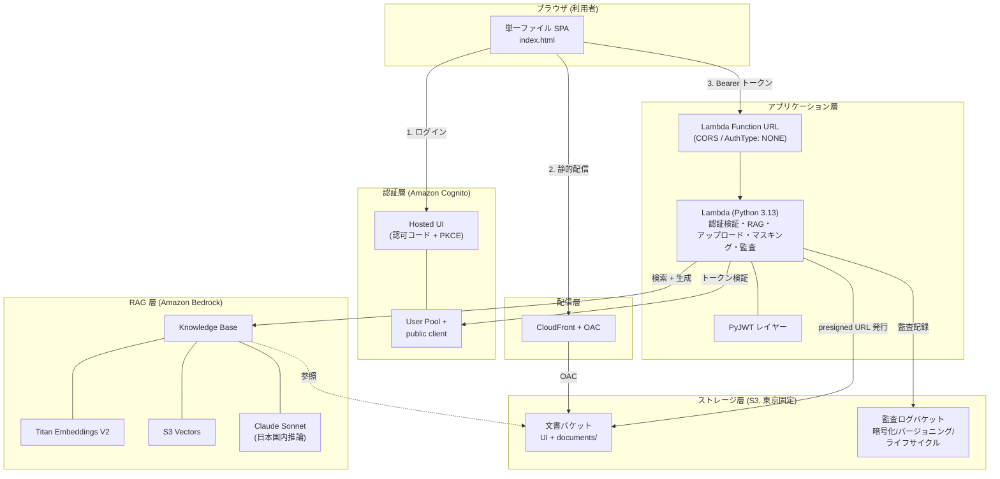
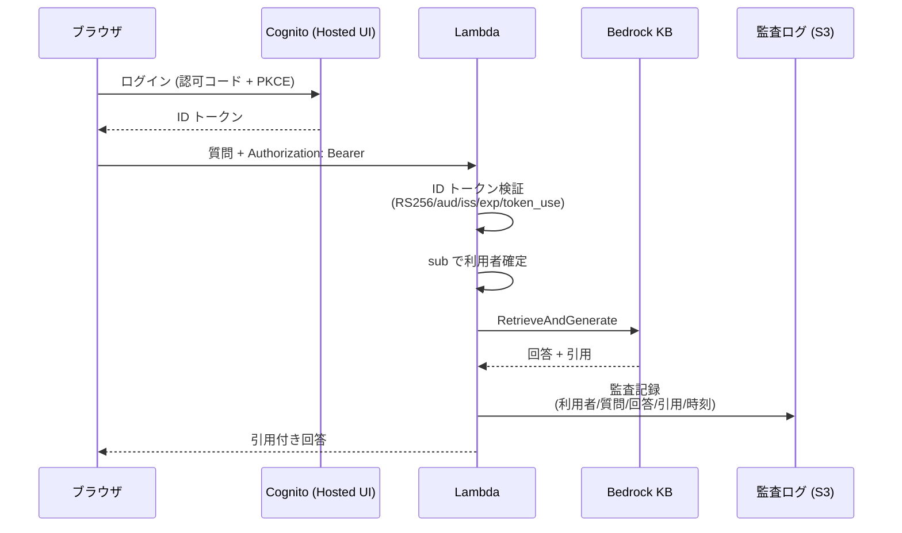
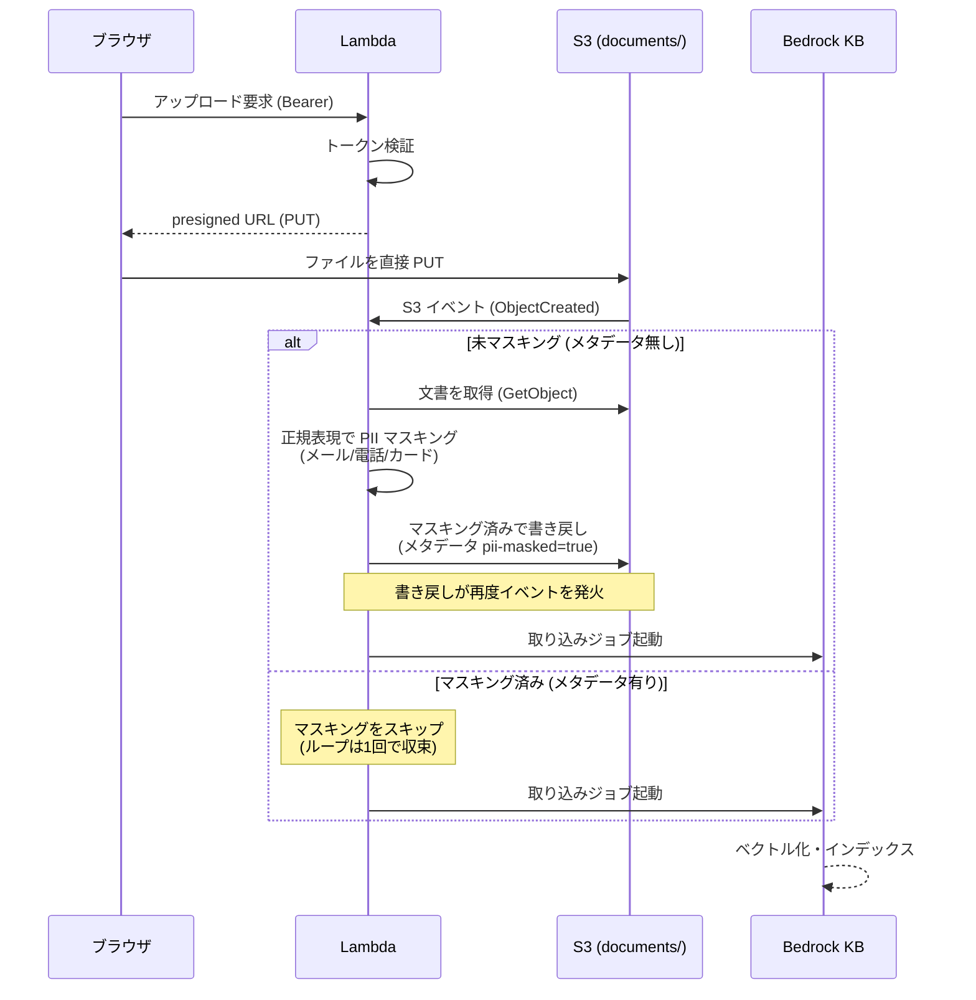
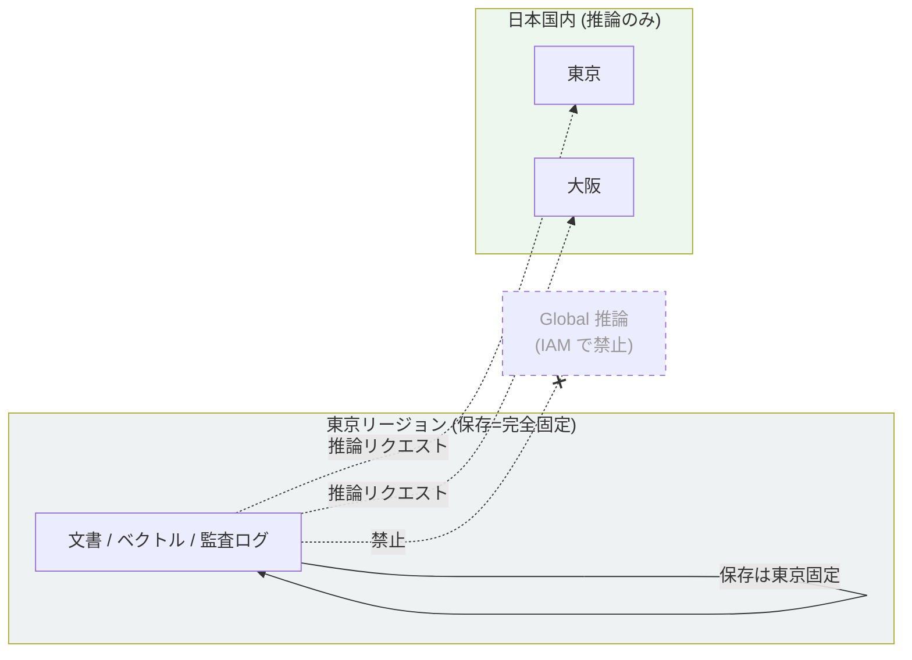
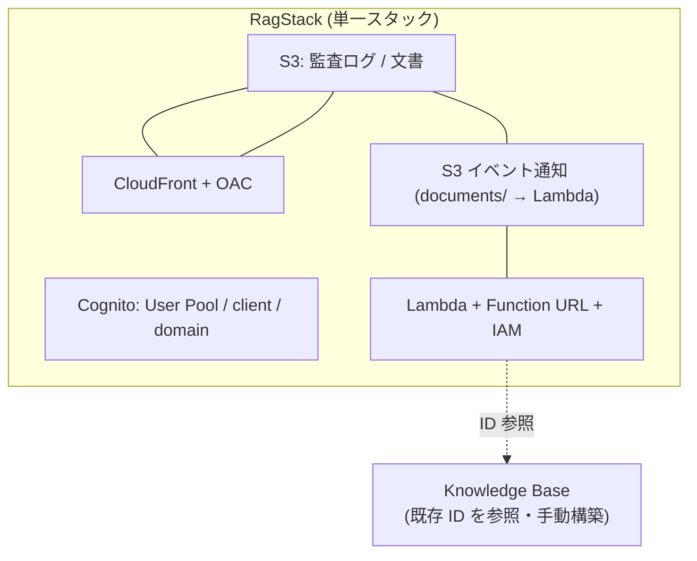

# アーキテクチャ

本ドキュメントは、システム構成・データフロー・データレジデンシ設計を図示します。
図は GitHub 上でネイティブにレンダリングされる Mermaid 記法で記述しています。

> 固有値(アカウント ID・エンドポイント URL・リソース ID 等)はすべてプレースホルダ化しています。

---

## 1. システム全体構成

---

## 2. 質問処理のシーケンス

---

## 3. アップロードと自動取り込み・PIIマスキングのシーケンス

---

## 4. データレジデンシの非対称設計

保存(文書・ベクトル・監査ログ)は東京リージョンに完全固定する一方、生成モデルが東京
In-Region 非対応のため、推論のみ日本国内(東京・大阪)に限定するクロスリージョン推論
プロファイルを用います。Global 推論は IAM レベルで禁止しています。

---

## 5. IaC のスタック構成

小規模かつリソースが密結合(文書バケットが CloudFront・Lambda・イベント通知と多方向に結合)
であるため、単一スタックに集約しています。スタックを分割すると、OAC のバケットポリシーや
S3 イベント通知が双方向参照を生み、循環参照が発生するためです。

Knowledge Base は L2 コンストラクト非対応かつ S3 Vectors との結合が複雑で、IaC 完全再現の
費用対効果が低いため、既存リソースを ID 参照する形にとどめ、構築手順は別途文書化しています。
